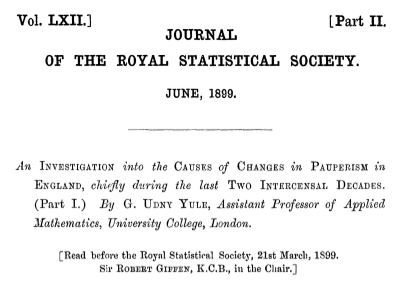
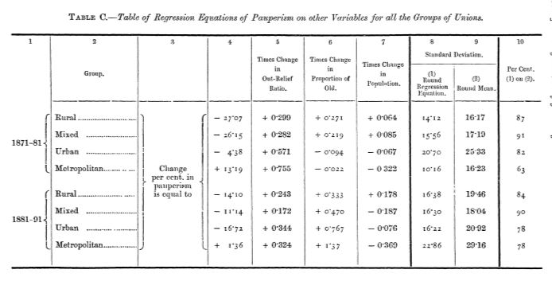
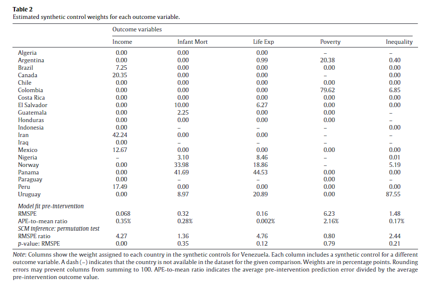
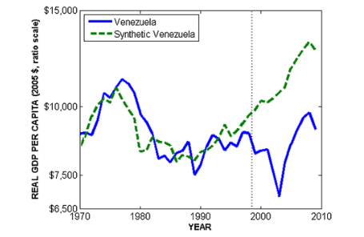
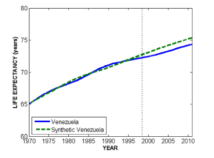
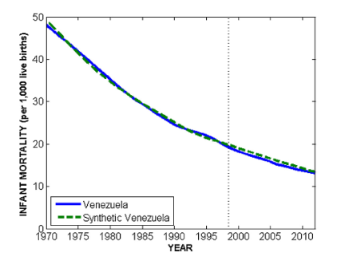
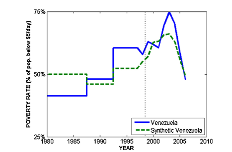
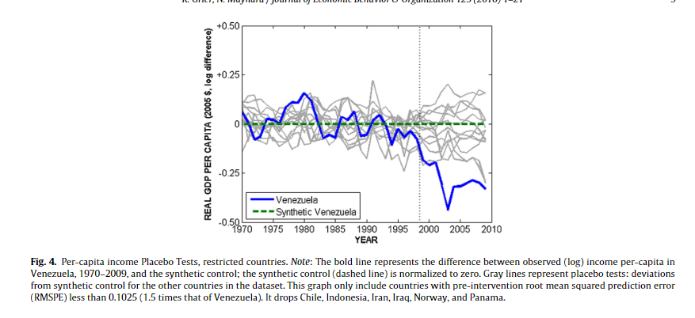

class: center, middle

```{css, echo=FALSE}
pre {
  max-height: 400px;
  overflow-y: auto;
}

pre[class] {
  max-height: 200px;
}
```

```{r, load_refs, include=FALSE, cache=FALSE}
# Initializes the bibliography
library(RefManageR)

library(knitr)
library(ggplot2)
library(dplyr)
library(readr)
library(nlme)
library(jtools)
library(hrbrthemes)
library(mice)

BibOptions(check.entries = FALSE,
           bib.style = "authoryear", # Bibliography style
           max.names = 3, # Max author names displayed in bibliography
           sorting = "nyt", #Name, year, title sorting
           cite.style = "authoryear", # citation style
           style = "markdown",
           hyperlink = FALSE,
           dashed = FALSE)
#myBib <- ReadBib("assets/myBib.bib", check = FALSE)
# Note: don't forget to clear the knitr cache to account for changes in the
# bibliography.
```
```{r xaringan-themer, include=FALSE, warning=FALSE}
library(xaringanthemer,MnSymbol)
style_mono_accent(
  base_color = "#1c5253",
  header_font_google = google_font("Josefin Sans"),
  text_font_google   = google_font("Montserrat", "300", "300i"),
  code_font_google   = google_font("Fira Mono"),
  text_font_size = "1.6rem"
)
```

---
### Basics of Multi-Method Research

-   Integrative multi-method designs

-   Strengths and weaknesses of regression and case studies

-   Detailed designs for combining case studies and regression

-   Formal analysis of optimal case selection strategies


---
```{r, echo = FALSE, out.width="70%", fig.retina = 1, fig.align='center'}

```


---



---
### Extending the Integrative Multi-Method Paradigm

-   Comparative-Case Designs

-   Natural experiments

-   True experiments

-   Case study-focused designs

-   Conceptualization, measurement, and theory building


---
### Experimental Designs


---
### Matching


---
### The Method of Difference

> If an instance in which the phenomenon under investigation occurs, and
> an instance in which it does not occur, have every circumstance in
> common save one, that one occurring only in the former; the
> circumstance in which alone the two instances differ is the effect, or
> the cause, or an indispensable part of the cause, of the phenomenon.
> (Mill 1843/2002)


---
### The Method of Difference

Debunking the Method of Difference


---
### The Potential Outcomes Framework

Strictly speaking, for the Method of Difference to work based on a
comparison between cases 1 and 2, the condition which must be met is:

$$\begin{aligned}
Y_{1,t} = Y_{2,t}\\
Y_{1,c} = Y_{2,c}
\end{aligned}$$


---
### Experiments

In a randomized experiment, it is true by the Law of Large Numbers that:

$$\begin{aligned}
\frac{\displaystyle\sum_{i: D_{i} = t}Y_{i,t}}{\displaystyle\sum_{i: D_{i} = t} i} \approx \frac{\displaystyle\sum_{j: D_{j} = C}Y_{j,t}}{\displaystyle\sum_{j: D_{j} = c} j}
\end{aligned}$$


---
### Experiments

In a randomized experiment, it is true by the Law of Large Numbers that:

$$\begin{aligned}
\frac{\displaystyle\sum_{i: D_{i} = t}Y_{i,c}}{\displaystyle\sum_{i: D_{i} = t} i} \approx \frac{\displaystyle\sum_{j: D_{j} = c}Y_{j,c}}{\displaystyle\sum_{j: D_{j} = c} j}
\end{aligned}$$


---
### Matching

Suppose, in an observational study, we somehow know that:

$$\begin{aligned}
Y_{T,i} = f(\mathbf{X}_{i}) + \epsilon_{i}\\
Y_{C,i} = g(\mathbf{X}_{i}) + \delta_{i}\\
E(\epsilon | \mathbf{X}) = 0\\
E(\delta | \mathbf{X}) = 0
\end{aligned}$$


---
### Matching

$$\begin{aligned}
E(Y_{T,i} | D_{i} = T, \mathbf{X}_{i} = \mathbf{W}) & = & f(\mathbf{W}) + E(\epsilon_{i})\\
                                                    & = & f(\mathbf{W}) \\
                                                    & = & E(Y_{T,i} | D_{i} = C, \\
                                                    &   & \mathbf{X}_{i} = \mathbf{W})
\end{aligned}$$

$$\begin{aligned}
E(Y_{C,i} | D_{i} = T, \mathbf{X}_{i} = \mathbf{W}) = \\
E(Y_{C,i} | D_{i} = C, \mathbf{X}_{i} = \mathbf{W})
\end{aligned}$$


---
### Matching

Let:

$\tau_{\mathbf{W}} = E(Y_{T,i} | D_{i} = T, \mathbf{X}_{i} = \mathbf{W}) -$

$E(Y_{C,i} | D_{i} = C, \mathbf{X}_{i} = \mathbf{W})$.

Also let $\mathbf{W}$ have probability density function $w()$.

Then the average treatment effect of $D$ on $Y$ for the population is:

$$ATE = \int \tau_{\mathbf{\omega}} w(\mathbf{\omega})\,d\mathbf{\omega}$$


---
### Matching as Second-Best

Matching is second-best to an experiment because:

1.  We need to identify an adequate collection of matching variables,
    $\mathbf{X}$.

2.  We need stronger modeling assumptions, including assumptions about
    the existence of and conditional means of $\epsilon$ and $\delta$.

3.  For further discussion, see Freedman, Pisani, and Purves (2007), Ch.
    1.


---
### Matching as Second-Best

Matching is second-best to a fully-specified regression analysis
because:

1.  We lose the efficiency of using all cases to estimate a small number
    of parameters.

2.  What is the S.E. of
    $\int \tau_{\mathbf{\omega}} w(\mathbf{\omega})\,d\mathbf{\omega}$?

3.  A well-specified regression sometimes comes closer to replicating
    experimental findings than do matching estimators (see, e.g.,
    Peikes, Moreno, and Orzol 2008).


---
### So, Why Match?

-   Experiments aren't always available.

-   Sometimes, we don't know $f()$ and $g()$.

-   Matching combines neatly with case studies.


---
### Three Causal Quantities

1.  ATE: $E(Y_{T} - Y_{C})$

2.  ATT: $E(Y_{T} - Y_{C} | D = T)$

3.  ATC: $E(Y_{T} - Y_{C} | D = C)$


---
### Pairwise Matching

1.  Take a sample of $N_{T}$ treatment cases and $N_{C}$ control cases.

2.  For each treatment case, find the control case that "best" matches
    on $\mathbf{X}$. Save the difference on $Y$ between those two cases

3.  Average the resulting paired differences. Use this as an estimate of
    ATT.


---
### Propensity Score

 definition
The *propensity score* for case $i$ is the probability that $D_{i} = T$
conditional on $\mathbf{X}_{i}$.


A well-estimated propensity score contains all the information about
$\mathbf{X}_{i}$ that is relevant to causal inference.


---
### Application: Female Legislators

-   It is widely believed that proportional representation electoral
    rules produce more female legislators than do single-member district
    rules (e.g., Kenworthy and Malami 1999, Matland 1998, Norris 2004,
    Paxton and Kunovich 2003, Reynolds 1999, Rule 1987, Siaroff 2000).

-   Several regression analyses have found effects in the neighborhood
    of 7-12%.


---
### Application: Female Legislators

-   These models have assumed that there is a single, constant effect of
    electoral rules on women's legislative inclusion. Is that assumption
    plausible?

-   For example, is the ATT equal to the ATC?


---
### Application: Female Legislators

```{r, echo = FALSE, out.width="70%", fig.retina = 1, fig.align='center'}
include_graphics("img/rscwomen.JPG")
```


---
### Matching for Case Selection

-   Selecting cases by matching can be used for data preprocessing to
    reduce model dependence (Ho, Imai, King, and Stewart 2007).

-   Matching can be used to select negative cases for statistical
    analysis.


---
### Application: Female Legislators

-   If electoral rules cause female legislative inclusion, then a change
    in rules should lead to a change in the number of female
    legislators.

-   The worldwide trend toward electing more female legislators is an
    obstacle to inference.

-   No-change cases are needed to allow difference-in-differences
    analysis.


---
### Application: Female Legislators

1.  Collect data on the election before and after every change in
    electoral rules since 1950.

2.  Collect data on every other democratic election since 1950.

3.  Code cases with a rule change as treatment cases, and cases without
    as control cases.

4.  Carry out propensity-score matching, and run the model on the cases
    in the matches.


---
### Application: Female Legislators


| Parameter            |  Estimate (S.E.)  |
| :------------------: |:-----------------:| 
| *Intercept*          | 1.461\*\* (0.587) | 
| *More Restrictive*   | 0.041 (1.192)     | 
| *Less Restrictive*   | 0.828 (1.128)     | 
| *Quota*              | -0.413 (1.024)    | 

$R^2$ = 0.008

*N* = 103


---
### Conclusions

-   Matching is rarely the ideal research design.

-   However, for many research questions, matching allows us to proceed
    in spite of being unable to execute the best research design.


---
### Comparing Cases

```{r, echo = FALSE, out.width="70%", fig.retina = 1, fig.align='center'}
include_graphics("img/ptmatches.JPG")
```

---
### Case Studies and Matching

Choosing Cases for In-Depth Study:

1.  Paired cases that make a very large contribution to the effect
    estimate

2.  The highest propensity-score treatment case, and the lowest
    propensity-score control case

3.  Extreme cases on $Y$


---

```{r, echo = FALSE, out.width="90%", fig.retina = 1, fig.align='center'}
include_graphics("img/ptfulltable.jpg")
```


---
###France


---


---
###Japan


---


---
###Fiji


---


---
###Malta


---


---
### Case Studies and Matching

Search for:

-   Confounding variables

-   Measurement error in the treatment variable

-   Causal pathways


---
### Manufacture Perfect Comparisons

Strictly speaking, for the Method of Difference to work based on a
comparison between cases 1 and 2, the condition which must be met is:

$$\begin{aligned}
        Y_{1,t} = Y_{2,t}\\
        Y_{1,c} = Y_{2,c}
\end{aligned}$$


---
### Manufacture Perfect Comparisons

No observable condition can ever guarantee that this assumption is met,
but if we were to find two cases that *exactly* match on a suitably rich
set of background variables $\mathbb{X}$, perhaps, we would believe the
assumption.


---
### Manufacture Perfect Comparisons

Unfortunately, if $\mathbb{X}$ is indeed a reasonably deep list of
variables, we are unlikely to find cases that in fact exactly match (or
even come particularly close).


---
### Manufacture Perfect Comparisons

Abadie and collaborators suggest that we create our own "synthetic"
control cases, by averaging together existing control cases to come as
close as possible to exactly matching the treatment case on
$\mathbb{X}$.


---
### Synthetic Control

The setup is one in which there are $N$ cases, each of which is observed
at multiple time periods labeled from 1 through $T$.


---
### Synthetic Control

Each case has a treatment and control potential outcome for each time
period. The difference between these is:

$\alpha_{i,t} = Y^T_{i,t} - Y^C_{i,t}$


---
### Synthetic Control

Suppose that the treatment of interest happens in one case at one time
period. That is, $D_{j,t}=0$ for all $j \neq i$ and for all
$t < t_{treat}$.


---
### Synthetic Control

$X_{i} -  \mathbb{X}_{j} W$


---
### Synthetic Control

$\sqrt{(X_{i} -  \mathbb{X}_{j} W)^{T} V (X_{i} -  \mathbb{X}_{j} W)}$


---
### Synthetic Control


---
### Synthetic Control

```{r, echo = FALSE, out.width="90%", fig.retina = 1, fig.align='center'}
include_graphics("img/chavezsynth.png")
```


---
### Synthetic Control

```{r, echo = FALSE, out.width="90%", fig.retina = 1, fig.align='center'}

```


---
### Synthetic Control

```{r, echo = FALSE, out.width="90%", fig.retina = 1, fig.align='center'}

```


---
### Synthetic Control

```{r, echo = FALSE, out.width="90%", fig.retina = 1, fig.align='center'}
include_graphics("img/chavezsynth4.png")
```


---
### Synthetic Control

```{r, echo = FALSE, out.width="90%", fig.retina = 1, fig.align='center'}

```


---
### Synthetic Control

```{r, echo = FALSE, out.width="90%", fig.retina = 1, fig.align='center'}

```


---
### Synthetic Control

```{r, echo = FALSE, out.width="90%", fig.retina = 1, fig.align='center'}

```


---
### Synthetic Control

```{r, echo = FALSE, out.width="90%", fig.retina = 1, fig.align='center'}
include_graphics("img/chavezsynth8.png")
```


---
### Synthetic Control

```{r, echo = FALSE, out.width="90%", fig.retina = 1, fig.align='center'}

```


---
### Synthetic Control

Synth library

