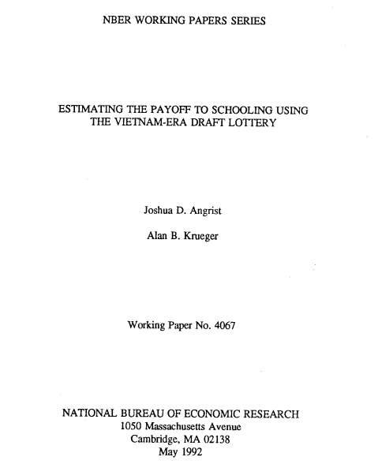
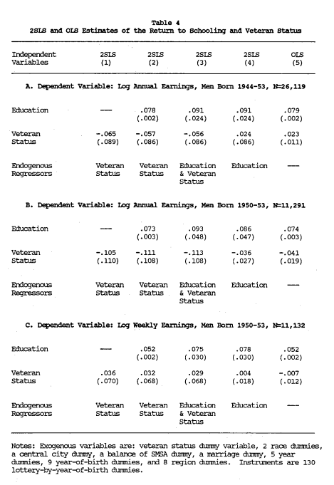
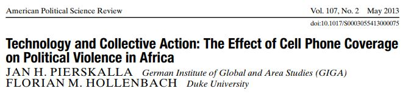
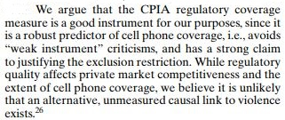
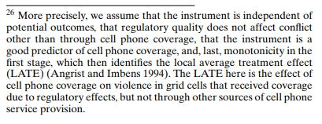
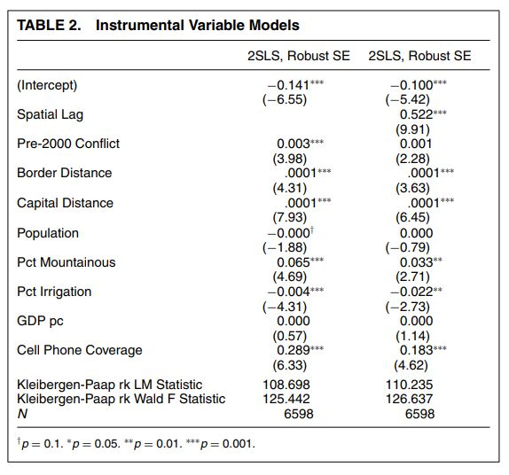
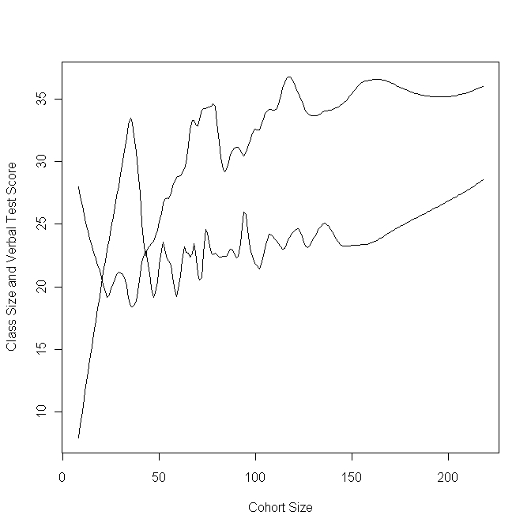
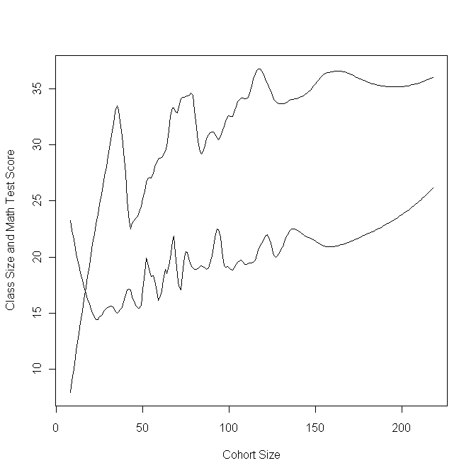

class: center, middle

```{css, echo=FALSE}
pre {
  max-height: 400px;
  overflow-y: auto;
}

pre[class] {
  max-height: 200px;
}
```

```{r, load_refs, include=FALSE, cache=FALSE}
# Initializes the bibliography
library(RefManageR)

library(knitr)
library(ggplot2)
library(dplyr)
library(readr)
library(nlme)
library(jtools)
library(hrbrthemes)
library(mice)

BibOptions(check.entries = FALSE,
           bib.style = "authoryear", # Bibliography style
           max.names = 3, # Max author names displayed in bibliography
           sorting = "nyt", #Name, year, title sorting
           cite.style = "authoryear", # citation style
           style = "markdown",
           hyperlink = FALSE,
           dashed = FALSE)
#myBib <- ReadBib("assets/myBib.bib", check = FALSE)
# Note: don't forget to clear the knitr cache to account for changes in the
# bibliography.
```
```{r xaringan-themer, include=FALSE, warning=FALSE}
library(xaringanthemer,MnSymbol)
style_mono_accent(
  base_color = "#1c5253",
  header_font_google = google_font("Josefin Sans"),
  text_font_google   = google_font("Montserrat", "300", "300i"),
  code_font_google   = google_font("Fira Mono"),
  text_font_size = "1.6rem"
)
```

---
### Typology of Natural Experiments

-   Classic Natural Experiment

-   Instrumental Variables-Type Natural Experiment

-   Regression-Discontinuity Design


---
### Classic Natural Experiment

1.  "Nature" randomizes the treatment.

    -   All (observable and unobservable) confounding variables are
        balanced between treatment and control groups.

    -   No discretion is involved in assigning treatments, or the
        relevant information is unavailable or unused.

2.  Randomized treatment has the same effect as non-randomized treatment
    would have.


---
### Classic Natural Experiment

-   Process tracing and the cause of the cause.

-   Process tracing to compare mechanisms inside and outside of the
    natural experiment.


---
### Snow on Cholera


---
### Brady and McNulty on Costs of Voting


---


---
### Vietnam War Draft Lottery


---


---
```{r, echo = TRUE, out.width="100%", fig.retina = 1, fig.align='center'}
draft1970 <- read_csv("data/draft1970.csv")
```
---
```{r, echo = TRUE, out.width="70%", fig.retina = 1, fig.align='center'}
boxplot(rank~month, data=draft1970)
```

---
```{r, echo = TRUE, out.width="100%", fig.retina = 1, fig.align='center'}
draftlm <- lm(rank ~ day, data=draft1970)
```
---
```{r, echo = TRUE, out.width="100%", fig.retina = 1, fig.align='center'}
summ(draftlm)
```
---
```{r, echo = TRUE, out.width="100%", fig.retina = 1, fig.align='center'}
draft1971 <- read_csv("data/draft1971.csv")
```
---
```{r, echo = TRUE, out.width="70%", fig.retina = 1, fig.align='center'}
boxplot(rank~month, data=draft1971)
```

---
```{r, echo = TRUE, out.width="100%", fig.retina = 1, fig.align='center'}
draft71lm <- lm(rank ~ day, data=draft1971)
```
---
```{r, echo = TRUE, out.width="100%", fig.retina = 1, fig.align='center'}
summ(draft71lm)
```


---

```{r, echo = FALSE, out.width="90%", fig.retina = 1, fig.align='center'}
include_graphics("img/angrist.jpg")
```


---
### Lottery Winners and Political Attitudes


---
### IV Natural Experiment

1.  "Nature" randomizes a cause of the treatment.

    -   Call the treatment $X$.

    -   Call the randomized cause of the treatment $Z$.

2.  $Z$ only affects $Y$ through its effects on $X$.

3.  Treatment caused by the randomized cause has the same effect as
    treatment with any other cause would have.


---
### IV Natural Experiment

-   Process tracing backwards from the cause of the cause.

-   Process tracing forward from the cause of the cause to the cause.

-   Process tracing between the cause and the outcome in a matched pair
    of cases.


---
### Colonialism and Development


---
### Colonialism and Development


---
### Colonialism and Development


---
### Colonialism and Development

```{r, echo = FALSE, out.width="70%", fig.retina = 1, fig.align='center'}
include_graphics("img/settlers4.PNG")
```


---
### Vietnam Draft Lottery and Returns to Education


```{r, echo = FALSE, out.width="80%", fig.retina = 1, fig.align='center'}

```

---
```{r, echo = FALSE, out.width="50%", fig.retina = 1, fig.align='center'}

```

---
```{r, echo = FALSE, out.height="100%", fig.retina = 1, fig.align='center'}

```

---
```{r, echo = FALSE, out.height="100%", fig.retina = 1, fig.align='center'}

```

---
```{r, echo = FALSE, out.height="100%", fig.retina = 1, fig.align='center'}

```

---
```{r, echo = FALSE, out.height="100%", fig.retina = 1, fig.align='center'}

```

---
### RDD

1.  There is an assignment variable, $Z$.

2.  Cases are assigned to treatment if and only if $Z$ is greater than a
    predetermined threshold value, $T$.

3.  There are enough cases that lots have scores of $Z$ that are just
    above and just below $T$.


---
### RDD

-   Assumptions 1 and 3 can be checked with the quantitative data.

-   For assumption 2, process trace the cause of the cause and the cause
    of the cause of the cause.


---
### Example: Maimonides' Rule

> "The number of pupils assigned to each teacher is twenty-five. If
> there are fifty, we appoint two teachers. If there are forty, we
> appoint an assistant, at the expense of the town." (Baba Bathra,
> Chapter II, page 21a; translated by Epstein 1976: 214)


---
### Example: Maimonides' Rule

> "Twenty-five children may be put in charge of one teacher. If the
> number in the class exceeds twenty-five but is not more than forty, he
> should have an assistant to help with the instruction. If there are
> more than forty, two teachers must be appointed." (Maimonides, given
> in Hyamson 1937: 58b)


---
### Example: Maimonides' Rule

```{r, echo = FALSE, out.width="65%", fig.retina = 1, fig.align='center'}

```

---
### Example: Maimonides' Rule

```{r, echo = FALSE, out.width="65%", fig.retina = 1, fig.align='center'}

```


---
### RDD

RDD isn't a good idea if:

-   Actors are aware of the discontinuity and adjust their behavior
    accordingly.

-   The variable which assigns the discontinuity is so coarsely measured
    or distributed that the cases nearest to the divide are not close to
    each other.


---
### Case Selection and Natural Experiments

-   Classic natural experiments: extreme values of the cause

-   IV natural experiments: extreme values of the cause of the cause;
    surprising values of the cause

-   RDD natural experiments: cases with power or privilege

