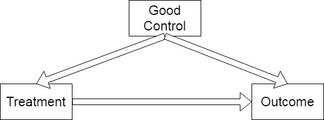
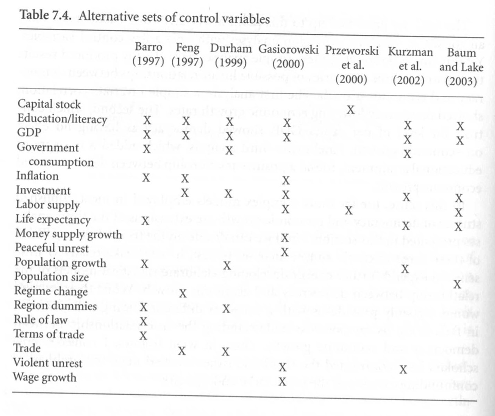
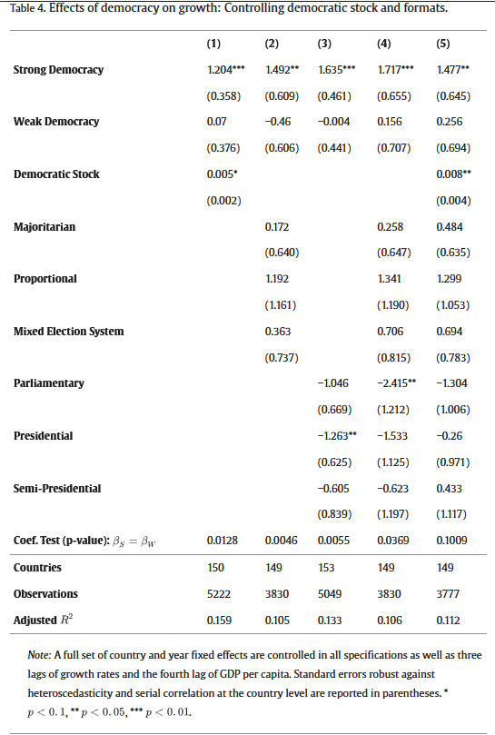

class: center, middle

```{css, echo=FALSE}
pre {
  max-height: 400px;
  overflow-y: auto;
}

pre[class] {
  max-height: 200px;
}
```

```{r, load_refs, include=FALSE, cache=FALSE}
# Initializes the bibliography
library(RefManageR)

library(knitr)
library(ggplot2)
library(dplyr)
library(readr)
library(nlme)
library(jtools)
library(hrbrthemes)
library(mice)

BibOptions(check.entries = FALSE,
           bib.style = "authoryear", # Bibliography style
           max.names = 3, # Max author names displayed in bibliography
           sorting = "nyt", #Name, year, title sorting
           cite.style = "authoryear", # citation style
           style = "markdown",
           hyperlink = FALSE,
           dashed = FALSE)
#myBib <- ReadBib("assets/myBib.bib", check = FALSE)
# Note: don't forget to clear the knitr cache to account for changes in the
# bibliography.
```
```{r xaringan-themer, include=FALSE, warning=FALSE}
library(xaringanthemer,MnSymbol)
style_mono_accent(
  base_color = "#1c5253",
  header_font_google = google_font("Josefin Sans"),
  text_font_google   = google_font("Montserrat", "300", "300i"),
  code_font_google   = google_font("Fira Mono"),
  text_font_size = "1.6rem"
)
```

---


---
### Regression in Multi-Method Research


---
### The Potential Outcomes Framework

-   We are interested in the effects of a dichotomous treatment (i.e.,
    independent variable).

-   This variable can be written as $D_{i} = (t,c)$.


---
### The Potential Outcomes Framework

-   For a given case, $i$, we either observe $D_{i} = t$ or $D_{i} = c$.
    If $D_{i} = t$, let us denote the value of the dependent variable as
    $y_{i,t}$. If $D_{i} = c$, let us denote the value of the dependent
    variable as $y_{i,c}$


---
### The Potential Outcomes Framework

-   The causal effect of $D$ on $y$ is:

    -   $y_{i,t} - y_{i,c}$


---
### The Average Treatment Effect

-   Sometimes, we are interested in developing an estimate of the effect
    of $D$ on $y$ in some population, from which we have a random sample
    (or even the whole population) split randomly into treatment and
    control cases.

-   Here, interest focuses on the "average treatment effect":

    -   $E(y_{i,t}) - E(y_{i,c})$


---
### Experiments and Causal Inference

-   Under random assignment, the set of cases where $D_{i} = t$ produces
    a random sample from the population of $y_{t}$. Likewise, the set of
    cases where $D_{i} = c$ produces a random sample from the population
    of $y_{c}$. Thus:

    -   $E(y_{i,t}|D_{i}=t) = E(y_{i,t})$

    -   $E(y_{i,c}|D_{i}=c) = E(y_{i,c})$

    -   $E(y_{i,t}) - E(y_{i,c}) = E(y_{i,t}|D_{i}=t) - E(y_{i,c}|D_{i}=c)$


---
### Regression in Experiments

Recall that $D_{i}$ as an indicator of treatment assignment in an
experiment. Let's change the coding, such that $D_{i}$ equals 1 for
treatment cases and 0 for control cases. Then we can write:

$$Y_{i} = D_{i} Y_{i,t} + (1 - D_{i}) Y_{i,c}$$

$$Y_{i} = Y_{i,c} + D_{i} (Y_{i,t} - Y_{i,c})$$


---
### Regression in Experiments

$$Y_{i} = \bar{Y_{i,c}} + D_{i} (\bar{Y_{i,t}} - \bar{Y_{i,c}}) + [Y_{i,c} - \bar{Y_{i,c}} + D_{i} (Y_{i,t} - \bar{Y_{i,t}} - Y_{i,c} + \bar{Y_{i,c}})]$$


---
### Regression in Experiments

Suppose we use OLS to estimate:

$$Y_{i} = \beta_{0} + \beta_{1} D_{i} + \epsilon_{i}$$

Will this work?


---
### Regression in Experiments

$$\hat{\beta}_{1} = \frac{cov(D, Y)}{var(D)} = \frac{\sum(D - \bar{D})(Y - \bar{Y})}{\sum(D - \bar{D})^2}$$

Let $\pi$ equal the proportion of cases assigned to the treatment group.

$$\hat{\beta}_{1} = \frac{\sum(D - \pi)(Y - \bar{Y})}{N \pi (1 - \pi)}$$


---
### Regression in Experiments

$$\hat{\beta}_{1} = \frac{\sum_{D_{i} = 1}(1 - \pi)(Y - \bar{Y}) - \sum_{D_{i} = 0}\pi (Y - \bar{Y})}{N \pi (1 - \pi)}$$

$$\hat{\beta}_{1} = \frac{\Sigma_{D_{i} = 1} (Y_{i} - E(Y_{i}))}{N \pi} - \frac{\Sigma_{D_{i} = 0}(Y_{i} - E(Y_{i}))}{N (1 - \pi)}$$


---
### Regression in Experiments

$$\hat{\beta}_{1} = \frac{\Sigma_{D_{i} = 1} Y_{i}}{N \pi} - \frac{\Sigma_{D_{i} = 0}Y_{i}}{N (1 - \pi)}$$

$N \pi$ is just the number of cases where $D_{i} = 1$, and $N (1 - \pi)$
is the number of cases where $D_{i} = 0$. So the last expression
simplifies to:

$$\hat{\beta}_{1} = \bar{Y}_{i, D_{i} = 1} - \bar{Y}_{i, D_{i} = 0}$$


---
### Regression in Experiments

Multivariate regression for experiments is *not* guaranteed to be
unbiased in the way that bivariate regression is. Multivariate
regression can be (even very badly) biased if:

-   Some control variable $W$ is included in the model that is in any
    way caused by the treatment, or


---
### Regression in Experiments

Multivariate regression for experiments is *not* guaranteed to be
unbiased in the way that bivariate regression is. Multivariate
regression can be (even very badly) biased if:

-   The causal effect of interest is highly heterogeneous across
    categories of the control variables.


---
### Regression for Causal Inference

$$\begin{aligned}
Y_{i} & = E(Y_{i,c}) + D_{i} \{E(Y_{i,t}) - E(Y_{i,c})\} + [Y_{i,c} - E(Y_{i,c})]\\
     & + D_{i} ([Y_{i,t} - E(Y_{i,t})] - [Y_{i,c} - E(Y_{i,c})])\\
     & = \mu_{0} + D_{i} (\mu_{1} - \mu_{0}) + \{\nu_{0} + D_{i} (\nu_{1} - \nu_{0})\}
\end{aligned}$$


---
### Regression for Causal Inference

-   A collection of control variables $\mathbb{X}$ will allow regression
    to produce an unbiased estimate of $(\mu_{1} - \mu_{0})$ when:

    1.  $D$ is uncorrelated with
        $\{\nu_{0} + D_{i} (\nu_{1} - \nu_{0})\}$ within each group
        defined by $\mathbb{X}$, and

    2.  the residual causal effect is not correlated with $\mathbb{X}$,
        and

    3.  a fully flexible parameterization of $\mathbb{X}$ is used.


---
### Regression for Causal Inference

$$\begin{aligned}
Y_{i} & = \mu_{0} + D_{i} (\mu_{1} - \mu_{0}) + \{\nu_{0} + D_{i} (\nu_{1} - \nu_{0})\}
\end{aligned}$$

$$\begin{aligned}
Y_{i} & = \mu_{0} + D_{i} (\mu_{1} - \mu_{0}) + \mathbb{X}_{i} \beta + \{\nu_{0}^{*} + D_{i} (\nu_{1}^{*} - \nu_{0}^{*})\}
\end{aligned}$$


---
### Regression for Causal Inference

-   These conditions imply that:

    1.  No element of $\mathbb{X}$ is on any causal path from
        $\mathbf{D}$ to $\mathbf{y}$, and

    2.  no element of $\mathbb{X}$ is caused by $\mathbf{D}$ or any of
        its unmeasured causes *and* some other unmeasured cause of
        $\mathbf{y}$, and

    3.  all causes of $\mathbf{D}$ that are also causes of $\mathbf{y}$
        have some element of $\mathbb{X}$ somewhere on the causal path
        from the unmeasured initial cause to either $\mathbf{D}$ or
        $\mathbf{y}$.


---



---


---


---


---


---
### Measurement Error


---


---


---


---


---


---
### Heterogeneity

-   If the causal effect is not constant across all cases, regression
    will not give a consistent estimate of the average treatment effect.

-   Instead, it estimates a covariance-adjusted weighted average of
    cases' treatment effects.


---
<figure>
<h3 id="aronow-and-samii-2016">Aronow and Samii 2016</h3>

</figure>


---
<figure>
<h3 id="aronow-and-samii-2016-1">Aronow and Samii 2016</h3>

</figure>


---
<figure>
<h3 id="aronow-and-samii-2016-2">Aronow and Samii 2016</h3>

</figure>


---
### Weights for Correct Causal Inference

It might sometimes be possible to get sample average treatment effects
by weighting cases by $1/w_{i}$. But this may break down if some cases
have weights equal to, or very close to, zero.


---
### Weights for Correct Causal Inference

As long as all weights are strictly greater than zero, then the
population causal inference can be derived from a regression where all
control variables are centered around their means and where all possible
interaction terms between control variables and the treatment are
included.


---
### Is Democracy Good for the Economy?


---
Democracy and Growth: A Case Study

1.  Which dependent variable should we use?

-   For this literature, there isn't much ambiguity: economic growth is
    the outcome of interest.


---
Democracy and Growth: A Case Study

1.  How should the dependent variable be measured, and perhaps
    transformed?

-   Once again, there is little controversy here: annual measures or
    period-averages.

-   And yet\...

    -   Should we focus on short-term or long-term growth?

    -   Should we use a transformation to limit the influence of extreme
        years, or not?


---
Democracy and Growth

1.  Which independent variables should we use?

-   Scholars have not achieved any degree of consensus regarding the
    proper set of control variables for a democracy-and-growth
    regression.


---
Democracy and Growth

1.  Which independent variables should we use?




---
Democracy and Growth

1.  Which independent variables should we use?

-   Consider education.

    -   Education, strangely enough, has a negative relationship with
        economic growth.

    -   Education has a positive relationship with democracy.


---
Democracy and Growth

1.  Which independent variables should we use?

-   Consider education.

    -   In a growth regression controlling only for lagged GDP,
        democracy has a significant coefficient of -0.00151.

    -   In a similar regression also controlling for primary school
        attainment, democracy has a significant coefficient of 0.04371.


---
Democracy and Growth

1.  Which independent variables should we use?

-   Consider education.

    -   Is education a cause or a consequence of democracy?


---
Democracy and Growth

1.  What functional form should the equation take?

-   In practice, the chosen functional form is almost always linear, but
    sometimes quadratic.

-   Interaction terms are rarely considered.

-   In particular, it is generally assumed that democracy has a single,
    universal causal effect on economic growth.


---
Democracy and Growth

1.  Should observations be treated as independent? If not, then how?

-   Many studies assume total independence. Some assume independence
    conditional on constant country and/or period effects.

-   Models exist that could consider diffusion of economic growth
    patterns along geographic or trade-network lines, for example.


---
Democracy and Growth

1.  What kind of interpretations can the resulting coefficients
    reasonably be given?

-   Strictly speaking, the coefficient estimates represent the slope, in
    one direction, of the best-fitting hyperplane through the observed
    data.


---
Democracy and Growth

1.  What kind of interpretations can the resulting coefficients
    reasonably be given?

-   Analysts virtually always interpret the coefficients as if they
    provided a description of causal counterfactuals applicable to each
    country in the data set.


---
Democracy and Growth

1.  What kind of interpretations can the resulting coefficients
    reasonably be given?

-   Less ambitious substantive interpretations are probably appropriate,
    but it is hard to know exactly what those interpretations should be.
    More theoretical development and more attention to mechanisms might
    help us guess what the various available coefficient estimates might
    mean.

---


---

---


---

---

```{r, echo = FALSE, out.width="50%", fig.retina = 1, fig.align='center'}

```


