```{r setup, include=FALSE}
library(knitr)
knitr::opts_chunk$set(echo = TRUE)
```


## Can we actually do multi-method research? Or is the idea hopeless?


---
### Let's examine a case of multi-method research

Why do some states in the U.S. have many fewer laws about labor than
other states?


---
### Galvin and Seawright (2023)

Probably it has something to do with unions?


---

```{r, echo = FALSE, out.width="50%", fig.retina = 1, fig.align='center'}
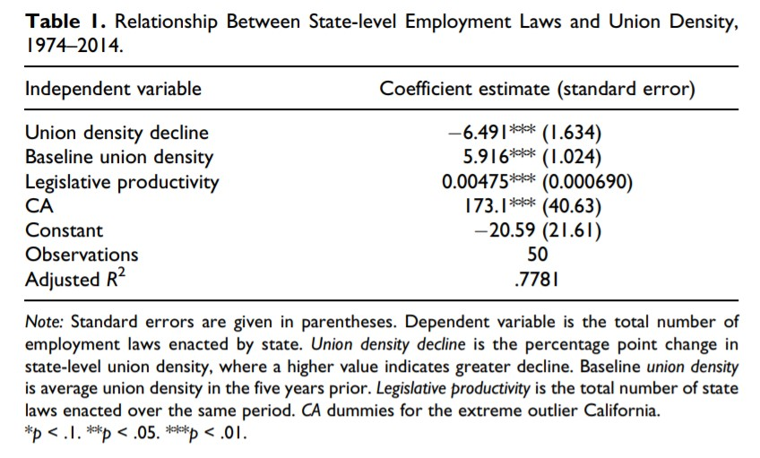
```

---

```{r, echo = FALSE, out.width="50%", fig.retina = 1, fig.align='center'}
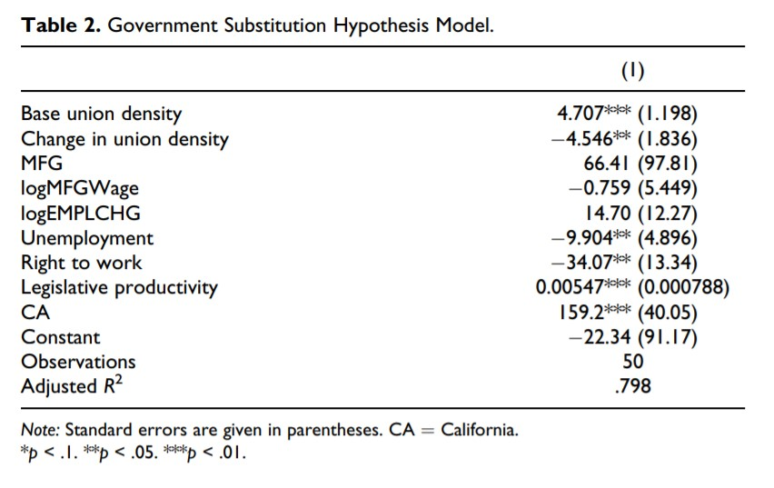
```

---

```{r, echo = FALSE, out.width="50%", fig.retina = 1, fig.align='center'}
include_graphics("galvin3.jpg")
```


---

```{r, echo = FALSE, out.width="50%", fig.retina = 1, fig.align='center'}
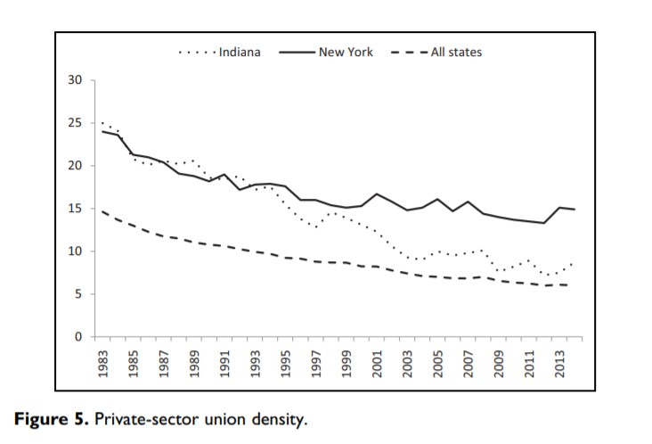
```

---

```{r, echo = FALSE, out.width="50%", fig.retina = 1, fig.align='center'}
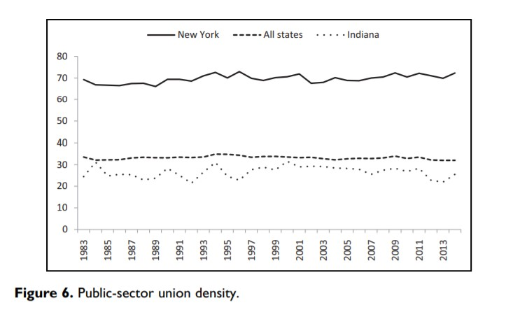
```


---

```{r, echo = FALSE, out.width="50%", fig.retina = 1, fig.align='center'}
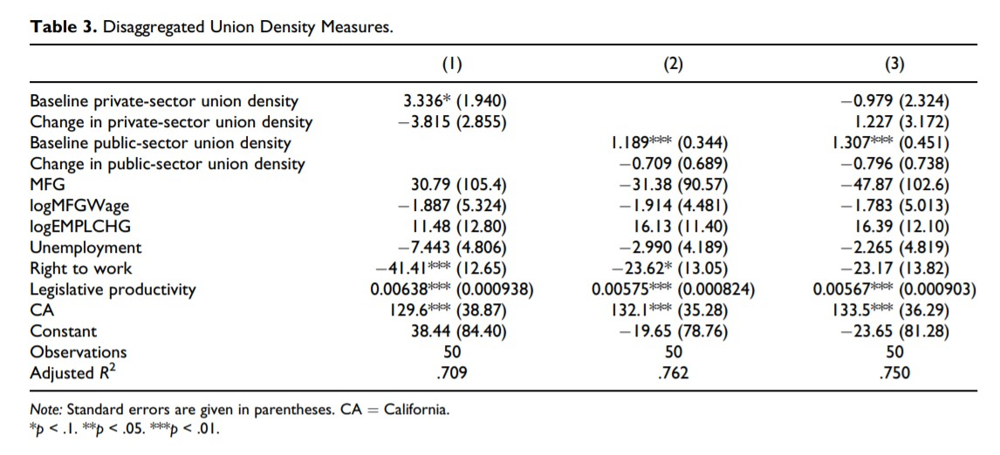
```


---

```{r, echo = FALSE, out.width="50%", fig.retina = 1, fig.align='center'}
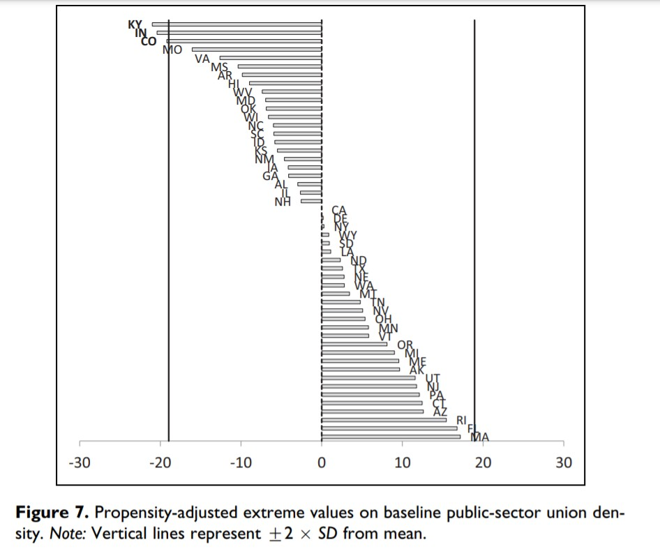
```


---

```{r, echo = FALSE, out.width="50%", fig.retina = 1, fig.align='center'}
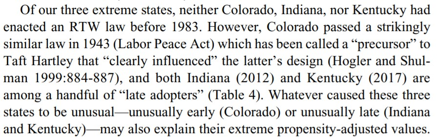
```

---

```{r, echo = FALSE, out.width="50%", fig.retina = 1, fig.align='center'}
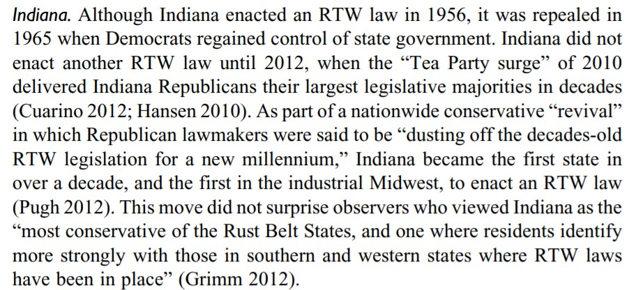
```

---

```{r, echo = FALSE, out.width="50%", fig.retina = 1, fig.align='center'}
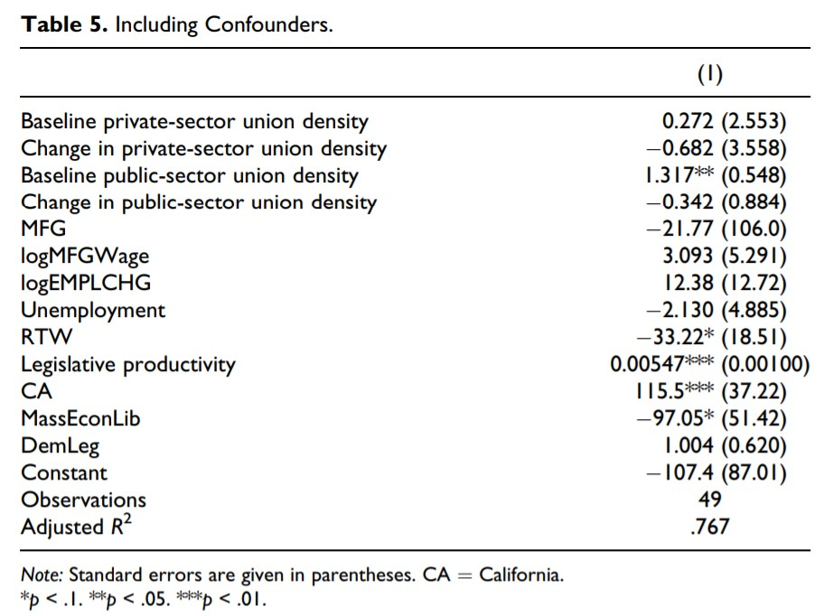
```

---

```{r, echo = FALSE, out.width="50%", fig.retina = 1, fig.align='center'}
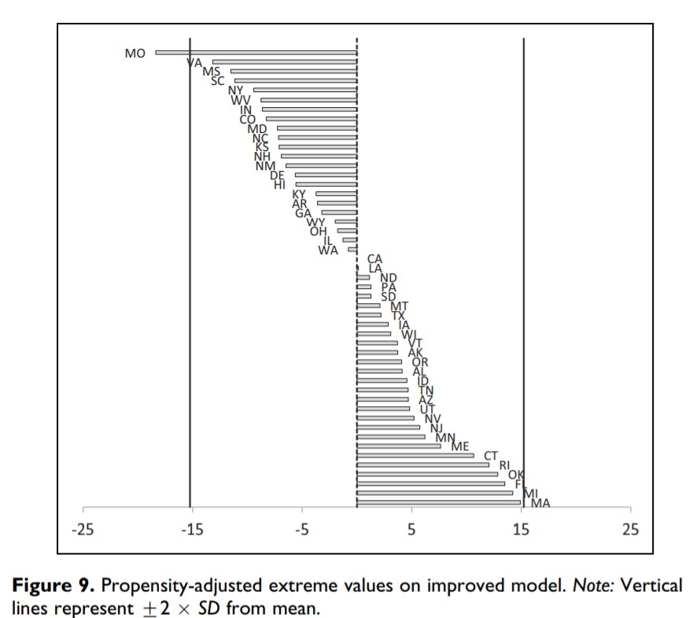
```

---

```{r, echo = FALSE, out.width="50%", fig.retina = 1, fig.align='center'}
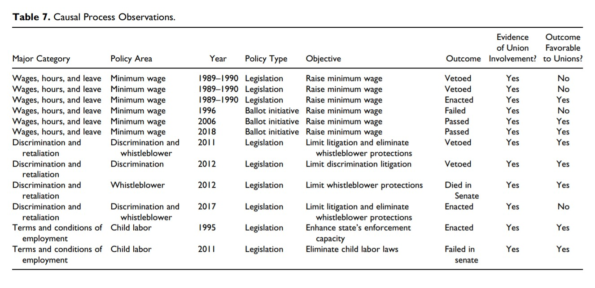
```

---

Whether we think these authors got everything (or anything!) about the substance right, lets ask:

  * Is there inferential work being done here with each methodological component that doesn't reduce to the other, or is one redundant?

---
### A Different Kind of Example

Laitin and Fearon (2003) report statistical evidence of a connection
between mountainous terrain and civil war.


---
### A Different Kind of Example

Logit coefficients for the relationship range between 0.12 and 0.42.


---
### A Different Kind of Example

```{r, echo = FALSE, out.width="50%", fig.retina = 1, fig.align='center'}
include_graphics("colombiamountains.jpg")
```


---
### A Different Kind of Example

Colombia experienced civil war through much of the 19th century


---
### A Different Kind of Example

```{r, echo = FALSE, out.width="50%", fig.retina = 1, fig.align='center'}
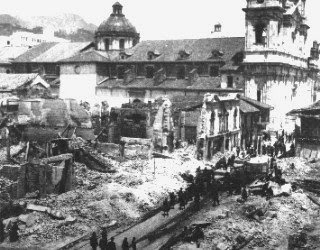
```

---
### A Different Kind of Example

```{r, echo = FALSE, out.width="50%", fig.retina = 1, fig.align='center'}
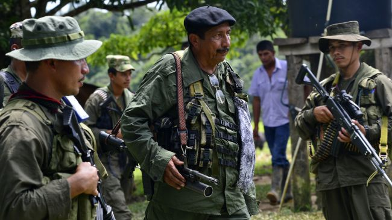
```

---
### A Different Kind of Example

```{r, echo = FALSE, out.width="50%", fig.retina = 1, fig.align='center'}
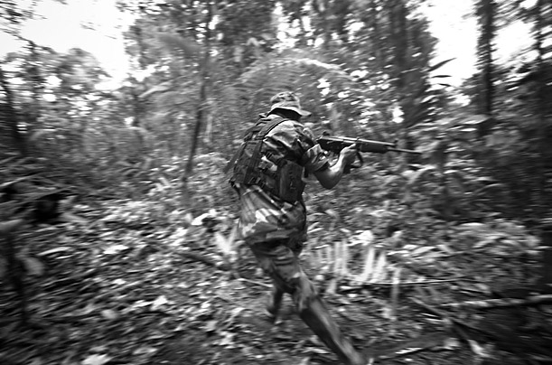
```

---
### A Different Kind of Example

```{r, echo = FALSE, out.width="50%", fig.retina = 1, fig.align='center'}

```

---

### What Is Multi-Method Research?

**Triangulation**  
Combination of research designs from more than one methodological family, each aimed at providing *separate* answers to a research question.

**Integrative Multi-Method Research**  
Techniques drawn from more than one methodological family used in the course of answering a *single integrated* research question or testing a *single overarching* hypothesis.
